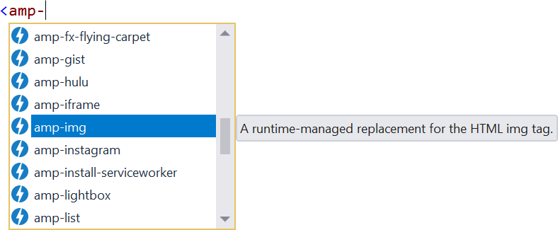
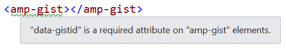

# Google AMP Tools

<!-- Replace this badge with your own-->

<!-- Update the VS Gallery link after you upload the VSIX-->
Download this extension from the [VS Gallery](https://visualstudiogallery.msdn.microsoft.com/[GuidFromGallery])
or get the [CI build](http://vsixgallery.com/extension/89e66607-5b1d-43a4-8da0-286801f8f60a/).

---------------------------------------

The [AMP Project](https://www.ampproject.org/) is an open-source initiative aiming to make the web better for all. The project enables the creation of websites and ads that are consistently fast, beautiful and high-performing across devices and distribution platforms.

See the [change log](CHANGELOG.md) for changes and road map.

## Features

- Intellisense
- Validation

### Intellisense
Full Intellisense is provided for both elements and attributes from the [AMP specification](https://www.ampproject.org/docs/reference/components).

### Validation
The validation helps to avoid common mistakes when building AMP based web applications.

## Contribute
Check out the [contribution guidelines](.github/CONTRIBUTING.md)
if you want to contribute to this project.

For cloning and building this project yourself, make sure
to install the
[Extensibility Tools](https://visualstudiogallery.msdn.microsoft.com/ab39a092-1343-46e2-b0f1-6a3f91155aa6)
extension for Visual Studio which enables some features
used by this project.

## License
[Apache 2.0](LICENSE)